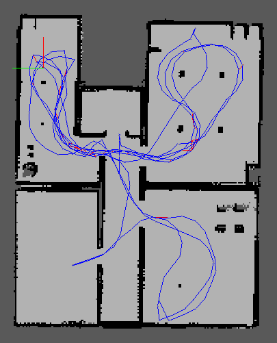

# Mapperbot: Graph SLAM in ROS/Gazebo Using RTAB-Map Package
Robot within ROS/Gazebo environment using the RTAB-Map package to generate a map to localize. This project was created during the udacity nano degree.

# Output
RTAB-Map generates a database containing the map data. The data can be analyzed using the database viewer
<pre>rtabmap-databaseViewer <path/to/rtabmap.db> </pre>
The screenshot below shows the generated 2D map:

An example of the association of key features is shown below:

# Installation/Run
Full installation instructions are given within the udacity course. After cloning the package into the /src folder of your catkin workspace build the packages with
<pre>$ catkin_make</pre>

and then open three terminals, navigate to your catkin workspace and source:
<pre>$ source devel/setup.bash</pre>

Then start physical environment in gazebo and rviz using
<pre>$ roslaunch my_robot world.launch</pre>

You can use keyboard commands to navigate through the environment starting the teleop package
<pre>$ roslaunch my_robot teleop.launch</pre>  

The map creation process is started via
<pre>$ roslaunch my_robot mapping.launch</pre>  

(Note: The path to the output file can be changed in the mapping.launch file. By default the map database is created in /root/.ros folder.)

After map creation you can use the created map for localization
<pre>$ roslaunch my_robot localization.launch</pre>  
(Note: The path to the output file can be changed in the localization.launch file. By default the map is loaded from the ./my_robot/maps folder.)
