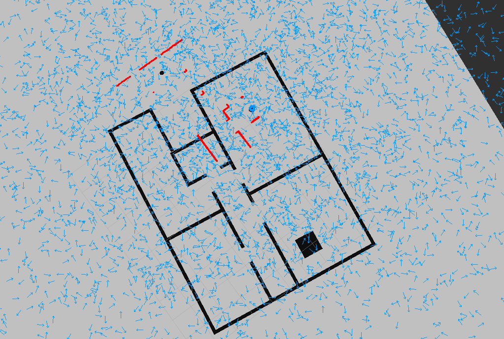
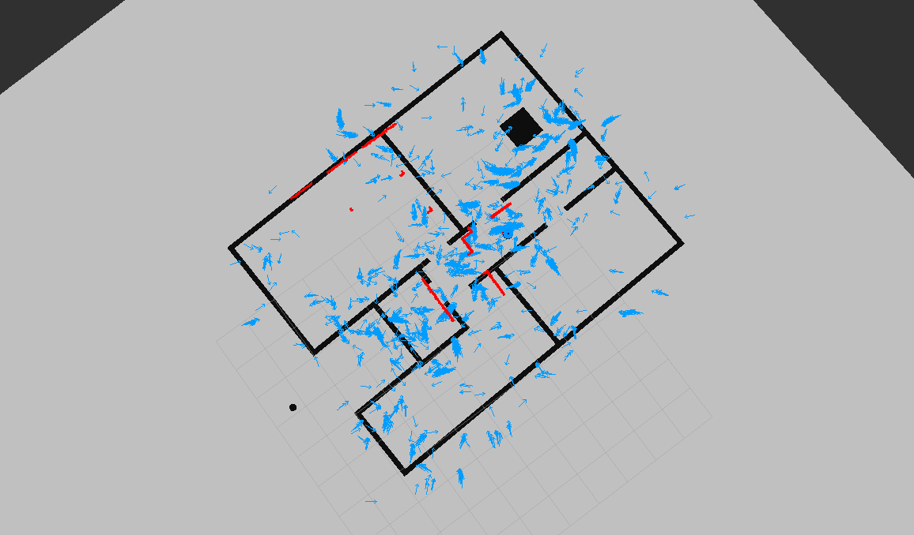
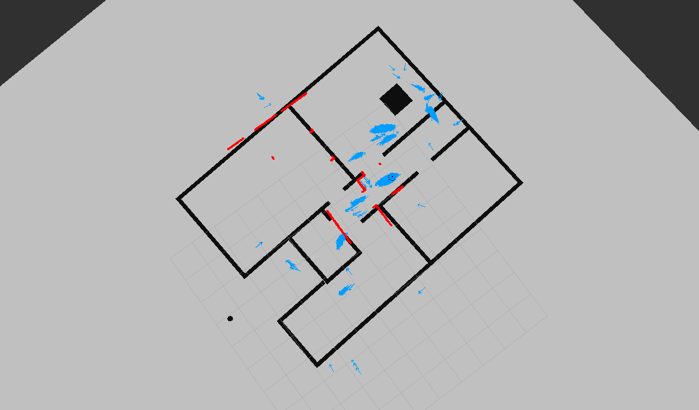
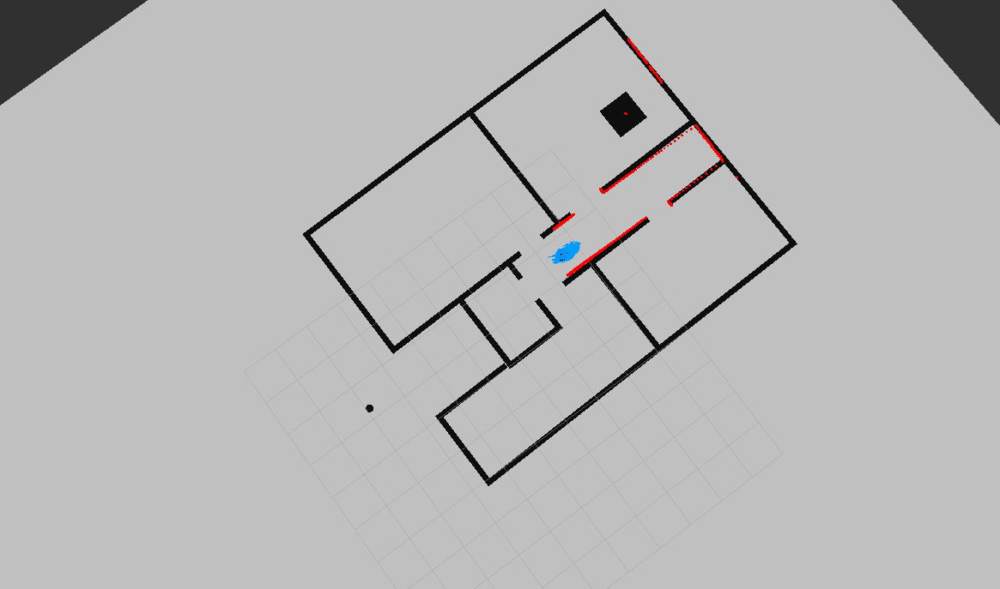

# Localizerbot: Adaptive Monte Carlo Localization using ROS/Gazebo
Robot within ROS/Gazebo environment using an established map to localize itself using adaptive Monte Carlo localization. This project was created during the udacity nano degree.

# Output
Initially, the exact position of the robot within the map is unknown. The red dots indicate the laser scan points by the robot which clearly do not match the map. The blue arrows indicate the "particles", i.e., potential poses of the robot.

The robot is manually being rotated using keyboard commands such that its view of the surrounding area changes. The previous particles are resampled to more likely poses:

In the end, the robot is localized quite well within the environment and keeps good track of its position:

<video width="320" height="240" controls>
  <source src="./doc/localization-2021-01-25_04.04.01.mp4" type="video/mp4">
</video>

# Parameter Tuning
A full list of parameters for tuning the AMCL can be found <a ref=http://wiki.ros.org/amcl#Parameters>here</a>. The parameters can be changed within the launch/amcl.launch file. From all available paramters the ones with the biggest impact for this particular worlds are
+ update_min_d, update_min_a: Decreasing this value to 0.1 and 0.05 respectively  will result in higher responsiveness of the localization to movement of the bot
+ intial_cov_xx, intial_cov_yy, intial_cov_aa: Increasing these values to 50, 50, and 10 respectively spreads out the initial particles such that the whole map is covered and any location within the world is regarded
+ laser_max_beams: Increasing this value increased the localization speed - it's currently set to 60 but lower values work as well. Though, values below 30 significantly lower the localization accuracy

# Installation/Run
Full installation instructions are given within the udacity course. After cloning the package into the /src folder of your catkin workspace build the packages with
<pre>$ catkin_make</pre>

and then open three terminals, navigate to your catkin workspace and source:
<pre>$ source devel/setup.bash</pre>

Then start physical environment in gazebo and rviz using
<pre>$ roslaunch my_robot world.launch</pre>

There is a rviz config within the /config folder which contains the setup for rviz visualization.

Finally, launch the AMCL package which runs the adaptive Monte Carlo localization
<pre>$ roslaunch my_robot amcl.launch</pre>
  
You can now either use the move_base plugin in rviz for commanding the robot to move through the world or keyboard commands. For the latter one use 
<pre>$ rosrun teleop_twist_keyboard teleop_twist_keyboard.py</pre>  
